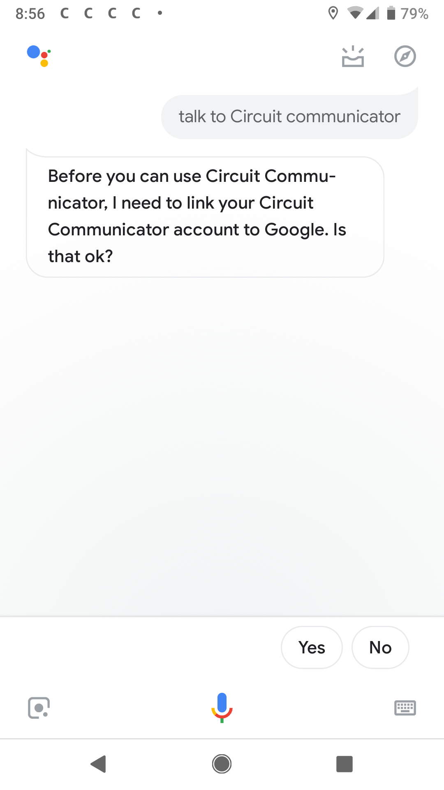
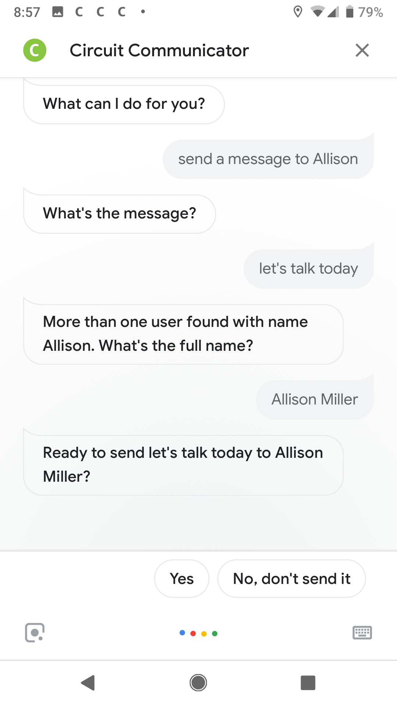
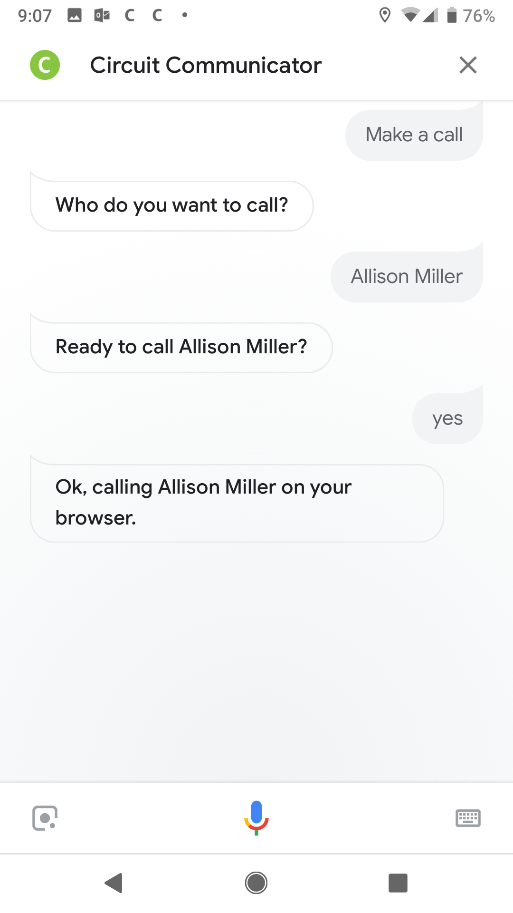

# Circuit Virtual Assistant

Integration between Circuit and Google Home (Google Virtual Assistant). Google Conversation Actions are built using DialogFlow. The exported DialogFlow agent is available as `circuit-va.zip`.

You don't need a Google Home. [Google Assistant](https://assistant.google.com/) also works on any Android and even iOS phone, the [web simulator](https://developers.google.com/actions/tools/web-simulator).

## How it works
Google Assistant listens for and Invocation Name (e.g. Circuit Communicator) to start the app and listens for commands. Once a match to an intent is found, the intent can either be handled on DialogFlow directly or by this node application via webhooks. The first time you launch the "Circuit Communicator", account linking is done via OAuth.


## Resources
 - https://developers.google.com/actions
 - https://dialogflow.com/
 - https://circuit.github.io/
 - https://circuitsandbox.net/sdk/


## Getting Started

### Configuration
Copy `config.json.template` as `config.json` and enter your credentials. You can request Circuit credentials at https://circuit.github.io/.

```json
// Get your own credentials at https://circuit.github.io
{
  "oauth": {
    "client_id": "<your Client ID>",
    "domain": "circuitsandbox.net"
  }
}
```

### Run the node app
The node app needs to be publicly accessible for Google Home to call your webhooks. That means to either host the app (heroku, aws, google cloud, etc) or a much better solution for development is [ngrok](https://ngrok.com/).  The webhook url then needs to be entered on DialogFlow's fullfillment page.

```bash
    git clone https://github.com/yourcircuit/circuit-google-assistant.git
    cd circuit-google-assistant
    npm install
    npm start
```

### Screenshots
<kbd></kbd>
<kbd></kbd>
<kbd></kbd>


