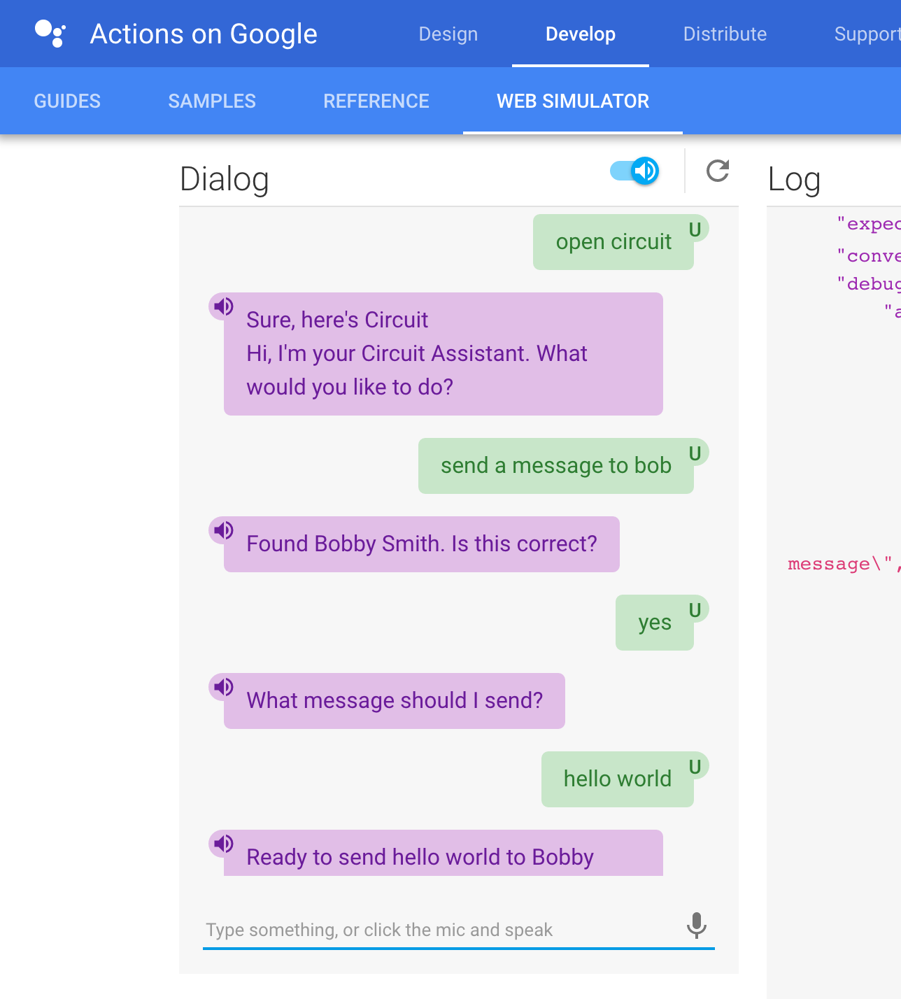

# Circuit Virtual Assistant

Integration between Circuit and Google Home (Google Virtual Assistant). Google Conversation Actions are built using API.AI. The exported API.AI agent is available as `va.zip`.

You don't need a Google Home. [Google Assistant](https://assistant.google.com/) also works on Pixel, the [web simulator](https://developers.google.com/actions/tools/web-simulator) and probably soon on other devices.

## How it works
Google Assistant listens for and Invocation Name (e.g. Circuit) to start the app and listens for commands. Once a match to an intent is found, the intent can either be handled on API.AI directly or by this node application via webhooks. In the file `va.js` you find the logic of conversation Google Assistant has with you for intents handled via webhooks.


## Resources
 - https://developers.google.com/actions
 - https://api.ai/
 - https://circuit.github.io/
 - https://circuitsandbox.net/sdk/


## Getting Started

### Configuration
Copy `config.json.template` as `config.json` and enter your credentials. You can request Circuit credentials at https://circuit.github.io/oauth.html.

The app supports a development mode for testing locally where the user can use OAuth 2.0 Client Credentials (`dev.oauth`). When running in production [Account Linking](https://developers.google.com/actions/develop/identity/account-linking) is required which means the user has to accept the OAuth permissions via the Google Home mobile app.

The webhook configuration is for Basic Authentication of the webhook and is optional. If defined, then make sure it matches the configuration on API.AI's fullfillment page.

```json
// This is an invalid client_id and secret - so don't even try it
// Get your own at https://circuit.github.io/oauth.html
{
  "oauth": {
    "client_id": "54af6933fc59415596fa024a538084a4",
    "domain": "circuitsandbox.net"
  },
  "dev": {
    "oauth": {
      "client_id": "14320b1e18ab41ca9c3ee700fde681a7",
      "client_secret": "71ee3a2a5f4549b299775420d5eaba37",
      "domain": "circuitsandbox.net"
    }
  },
  "webhook": {
    "users": { 
      "admin": "mysecret"
    }
  },
  "logging": {
    "nodeapp": "trace",
    "circuit-sdk": "info"
  }
}
```

For production mode a Google Project ID is required to be in API.AIs when publishing the app. A Google Project ID can be obtained at the [Google Developer Console](https://console.developers.google.com). You'll need to enable the Google Actions API.

### Run the node app
The node app needs to be publicly accessible for Google Home to call your webhooks. That means to either host the app (heroku, aws, google cloud, etc) or a much better solution for development is [ngrok](https://ngrok.com/).  The webhook url then needs to be entered on API.AI's fullfillment configuration.

```bash
    git clone https://github.com/yourcircuit/circuit-google-assistant.git
    cd circuit-google-assistant
    npm install
    curl "https://circuitsandbox.net/circuit.tgz" -o "circuit.tgz"
    npm install circuit.tgz
    npm start    // development: npm start dev
```

View node app and Circuit SDK bunyan logs in logs subfolder.
```bash
	tail -f logs/sdk.log | bunyan
	tail -f logs/app.log | bunyan
```


### Action on Google - Web Simulator




